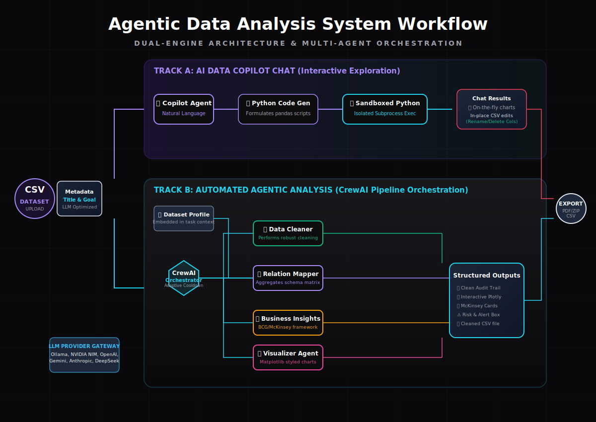

# Multi-Agent Data Analysis System with CrewAI

<p align="center">
  
</p>

<p align="center">
  
  &nbsp;&nbsp;
  
  
  
  
  
</p>

> **Autonomous Data Intelligence as a Service** | A premium, modular data-analyst pipeline powered by LLM-driven agents. Upload a CSV to initialize a workspace, chat with your dataset in real-time, execute custom schema modifications via natural language, and run a complete multi-agent pipeline to generate structured audits, correlation maps, and executive business summaries.

---

## 🚀 Dual-Engine Workspace

Once a project is initialized, the system branches into two distinct, high-impact paths:

### Track A: AI Data Chat (Interactive Exploration)
- **Natural Language Querying**: Query your dataset directly to get condition-based rows, statistics, or aggregations.
- **On-the-Fly Data Prep**: Ask the copilot to perform edits in-place, such as `Rename column "Q3_Sales" to "Sales_Q3"` or `Delete column "Notes"`, and watch the live data preview table update dynamically.
- **Instant Visualizations**: Command the chat bot to create custom charts (e.g. *"plot a neon-purple scatter chart of rating vs cost"*). It writes and runs the matplotlib code in a sandboxed subprocess to output charts inline.

### Track B: Agentic Analysis (CrewAI Pipeline)
Select and run specific automated tasks through the multi-agent pipeline:
1. **Data Cleaner (🧹)**: Audits columns, formats values, drops redundant rows, and generates a structured cleaning audit trail.
2. **Relationship Mapper (🔗)**: Maps numeric and categorical variables, rendering zoomable, interactive **Plotly** correlation charts.
3. **Business Insights (💡)**: Analyzes statistical summaries and generates McKinsey/BCG consulting cards (Observation ➔ Implication ➔ Strategy) alongside critical risk alerts.
4. **Visualizer Agent (📈)**: Automatically creates, styles, and saves formatted matplotlib PNG graphs.

---

## 🛠️ Installation & Setup

1. **Clone & Navigate**:
   ```bash
   git clone https://github.com/your-username/Multi-Agent-Data-Analysis-System-with-CrewAI.git
   cd Multi-Agent-Data-Analysis-System-with-CrewAI
   ```

2. **Initialize Environment**:
   ```bash
   python -m venv .venv
   # Windows:
   .\.venv\Scripts\Activate.ps1
   # macOS/Linux:
   source .venv/bin/activate
   ```

3. **Install Dependencies**:
   ```bash
   pip install -r requirements.txt
   ```

4. **Launch Server**:
   ```bash
   # Start the FastAPI Web App
   python -m uvicorn main:app --host 127.0.0.1 --port 8000
   ```
   *Alternatively, double-click `run_web.bat` (Windows) to boot the server automatically.*

5. **Open Browser**:
   Navigate to [http://127.0.0.1:8000](http://127.0.0.1:8000)

---

## 📂 Project Structure

```
.
├── agents/               # CrewAI Agent factories
│   ├── cleaner.py        # 🧹 Data Cleaner Agent
│   ├── relation.py       # 🔗 Relationship Analyst Agent
│   ├── insights.py       # 💡 BI McKinsey Insights Agent
│   └── visualizer.py     # 📈 Matplotlib Visualizer Agent
├── config/               # Platform configuration
│   ├── llm_config.py     # Multi-Provider settings and model catalog
│   └── __init__.py
├── tools/                # Orchestration tools
│   └── dataset_tools.py  # read_head, subprocess sandbox runner, plotly builder
├── ui/                   # Document export services
│   └── export.py         # Formatted PDF Cover & Content builder
├── workflows/            # Workflow pipelines
│   └── pipeline.py       # Make pipeline orchestration (adaptive cooldown)
├── web/                  # Web Frontend Assets
│   ├── index.html        # Glassmorphic Workspace structure
│   ├── app.js            # Frontend core logic (SSE logs, Chat, API hooks)
│   └── style.css         # Dark Electric-Violet Theme styles
├── data/                 # Dynamic project sessions
│   └── sessions/         # Concurrency-isolated session directories
│       └── <session_id>/
│           ├── original_upload.csv
│           ├── cleaned.csv
│           └── metadata.json
├── outputs/              # Sandbox generated PNG charts
│   └── <session_id>/
├── assets/               # Static icons and complete_workflow.svg
├── requirements.txt      # Python package catalog
├── main.py               # FastAPI backend routing endpoints
├── README.md             # This file
├── USAGE.md              # Detailed user guide
├── CHANGELOG.md          # Version history
└── LICENSE               # MIT License
```

---

## ⚙️ Provider Gateway Support
The system integrates a custom gateway supporting **13+ LLM providers** through local configuration or environment variables:
- **Cloud Gateways**: OpenAI, Anthropic, Google Gemini, NVIDIA NIM, Groq, Mistral, TogetherAI, Cohere, OpenRouter, DeepSeek, Perplexity, HuggingFace.
- **Local Sandbox**: Ollama (auto-detects local models via the Ollama catalog).

---

*Multi-Agent Data Analysis System*  
*Copyright (c) 2025 Sowmiyan S*  
*Licensed under the MIT License*
