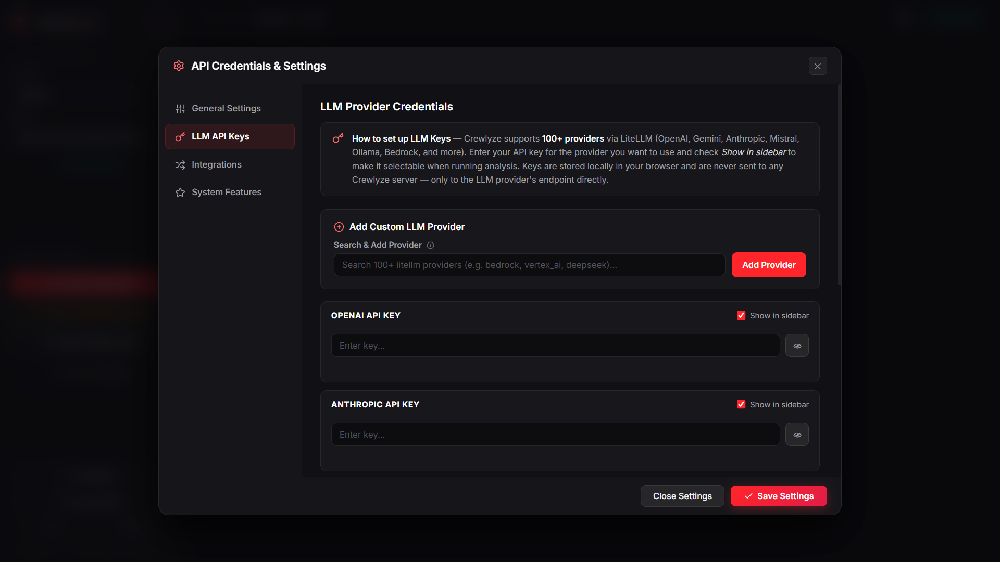

<div align="center">
  
</div>

<br />

<h1 align="center" style="font-size: 3.5rem; font-weight: 800; letter-spacing: -1px; margin-bottom: 0;">
  🚀 Crewlyze 🚀
</h1>

<p align="center">
  <strong style="font-size: 1.4rem; color: #a78bfa;">The Premier Autonomous Multi-Agent Business Intelligence & Data Science Platform</strong><br />
  <em>Transforming raw CSV, Excel, and SQLite datasets into C-suite executive PDF reports, custom interactive visualizations, and strategic business intelligence in seconds.</em>
</p>

<p align="center">
  <a href="https://github.com/sowmiyan-s/Multi-Agent-Data-Analysis-System-with-CrewAI/releases">
    
  </a>
  <a href="https://www.npmjs.com/package/crewlyze">
    
  </a>
  <a href="https://python.org">
    
  </a>
  <a href="https://github.com/sowmiyan-s/Multi-Agent-Data-Analysis-System-with-CrewAI/stargazers">
    
  </a>
  <a href="https://github.com/sowmiyan-s/Multi-Agent-Data-Analysis-System-with-CrewAI/network/members">
    
  </a>
  <a href="https://opensource.org/licenses/MIT">
    
  </a>
</p>

<p align="center">
  <a href="#-quick-start-one-line-installer">⚡ Fast Setup</a> •
  <a href="#-live-application-interface-showcase">📸 Live Demo</a> •
  <a href="#-core-capabilities--deep-feature-breakdown">✨ Key Features</a> •
  <a href="#-architecture--multi-agent-orchestration">🏗️ Architecture</a> •
  <a href="#-universal-llm-gateway-matrix">🔑 LLM Gateways</a> •
  <a href="#-outbound-integrations-hub">📬 Integrations</a> •
  <a href="#-api-reference-matrix">🔌 REST API</a>
</p>

---

## ⚡ Quick Start (One-Line Installer)

Launch Crewlyze instantly on **Windows**, **macOS**, or **Linux** without manually installing C++, Rust, or Java build toolchains:

```bash
# 1. Install Crewlyze globally via NPM
npm install -g crewlyze

# 2. Launch the platform from anywhere in your terminal
crewlyze
```

> 🎉 **Zero-Compiler Setup:** Prebuilt Python binary wheels install automatically. The backend server initializes dynamically on port `8000` and automatically opens your web browser to `http://localhost:8000`.

---

## 📑 Table of Contents

<details open>
<summary><strong>Click to Expand / Collapse Table of Contents</strong></summary>

1. [🌍 Executive Vision & Enterprise ROI](#-executive-vision--enterprise-roi)
2. [📊 Enterprise Comparison Matrix](#-enterprise-comparison-matrix)
3. [📸 Live Application Interface Showcase](#-live-application-interface-showcase)
4. [✨ Core Capabilities & Deep Feature Breakdown](#-core-capabilities--deep-feature-breakdown)
   - [🤖 Autonomous 4-Agent Swarm Orchestration](#-autonomous-4-agent-swarm-orchestration)
   - [💬 Real-Time AI Chat & Streaming Copilot](#-real-time-ai-chat--streaming-copilot)
   - [📊 Unlimited Custom Visualization Engine](#-unlimited-custom-visualization-engine)
   - [🔍 Read-Only SQL Query Workbench](#-read-only-sql-query-workbench)
   - [🔄 Stay-on-Page Workspace Reload Persistence](#-stay-on-page-workspace-reload-persistence)
5. [🏗️ Architecture & Multi-Agent Orchestration](#-architecture--multi-agent-orchestration)
6. [🔑 Universal LLM Gateway Matrix](#-universal-llm-gateway-matrix)
7. [📬 Outbound Integrations Hub (SMTP & Discord)](#-outbound-integrations-hub-smtp--discord)
8. [🛡️ Production Security & Privacy (Air-Gapped Setup)](#️-production-security--privacy-air-gapped-setup)
9. [🚀 Deployment Modes & Installation Options](#-deployment-modes--installation-options)
10. [🔌 API Reference Matrix](#-api-reference-matrix)
11. [🛠️ Troubleshooting & FAQ](#️-troubleshooting--faq)
12. [🤝 Contributing & Star History](#-contributing--star-history)
13. [📜 License & Legal](#-license--legal)

</details>

---

## 🌍 Executive Vision & Enterprise ROI

In modern data-driven organizations, the biggest bottleneck is no longer data collection—it is **data interpretation speed**. Data analysts spend 80% of their work hours writing repetitive Pandas cleaning scripts, running correlation matrices, and manually formatting slide decks for executive leadership.

**Crewlyze** eliminates this friction by deploying an **Autonomous Multi-Agent AI Swarm**. Powered by [CrewAI](https://github.com/joaomdmoura/crewai) and [LiteLLM](https://github.com/BerriAI/litellm), Crewlyze models a collaborative human data science department. Specialized AI agents independently audit data hygiene, map complex non-linear correlations, formulate C-suite SWOT strategies, and construct interactive dashboards—all in under 3 minutes.

### 💰 Compounding Enterprise Value & ROI
- **⚡ 98% Time Reduction:** Replaces 15–20 hours of manual Exploratory Data Analysis (EDA) with a 3-minute executive audit report.
- **🔓 Data Democratization:** Non-technical executives can upload raw CSV/Excel/SQLite files and immediately receive actionable business recommendations without typing SQL or Python.
- **🔒 100% Air-Gapped Privacy:** Connect to **Ollama** (`http://localhost:11434`) to run 100% private, offline data analysis on local hardware with zero external API data transmission.

---

## 📊 Enterprise Comparison Matrix

| Feature / Capability | Crewlyze | Traditional BI (Tableau / PowerBI) | ChatGPT / Claude Web | Custom Python Scripts |
| :--- | :---: | :---: | :---: | :---: |
| **Autonomous Multi-Agent Swarm** | ✅ **Built-in** | ❌ Manual | ❌ Single-Turn | ❌ Requires Coding |
| **Real-Time Token Streaming** | ✅ **Built-in (SSE)** | ❌ N/A | ✅ Web Only | ❌ Complex Setup |
| **Unlimited Custom Viz Engine** | ✅ **Matplotlib/Seaborn (<0.2s)** | ⚠️ Rigid Templates | ⚠️ Basic Code Execution | ⚠️ Manual Scripting |
| **100% Offline Air-Gapped Mode** | ✅ **Ollama Local** | ❌ Cloud-gated | ❌ Requires Cloud | ✅ Manual Local |
| **Outbound Email & Discord Dispatch** | ✅ **Automated (SMTP/Discord)** | ⚠️ Expensive Addons | ❌ None | ❌ Manual Webhooks |
| **Read-Only SQL Timeout Guard** | ✅ **Built-in (3s Guard)** | ⚠️ Manual Queries | ❌ None | ❌ Manual Guardrails |
| **Zero-Compiler Setup** | ✅ **`npx crewlyze`** | ❌ Complex Desktop App | ❌ Web Browser Only | ❌ Complex Venv Setup |

---

## 📸 Live Application Interface Showcase

Explore live previews captured directly from an active Crewlyze workspace session:

| Application Module | Live Interface Preview & Description |
| :--- | :--- |
| **🤖 Real-Time AI Chat & Custom Viz Engine** | <br><em>Real-time AI Chat streaming with subtle blinking Thinking... status, slash <code>/</code> column autocomplete picker, custom Matplotlib/Seaborn visualization generation, and single 1-click <code>📥 Download PNG</code> button overlays.</em> |
| **🏢 Project Workspace Hub** | <br><em>Central project hub with stay-on-page reload state management, dataset preview grid, and instant navigation between Crew Analysis and AI Chat.</em> |
| **📊 Interactive Dashboards & Plotly Engine** | <br><em>Autonomous multi-agent Plotly chart suite with responsive hover tooltips, zoom/pan controls, and feature distribution maps.</em> |
| **💼 Strategic Business Insights & SWOT** | <br><em>C-suite strategic insights, SWOT risk matrices, correlation analysis, and automated executive action item recommendations.</em> |
| **⚙️ Settings & Universal LLM Config** | <br><em>Configure 100+ cloud & local LLMs (Ollama, OpenAI, Anthropic, Gemini, NVIDIA, Minimax) and SMTP / Discord outbound webhooks.</em> |

---

## ✨ Core Capabilities & Deep Feature Breakdown

### 🤖 Autonomous 4-Agent Swarm Orchestration
Crewlyze delegates dataset processing across a sequential multi-agent workflow:

```
[Raw CSV / Excel / SQLite]
           │
           ▼
  ┌─────────────────────────────────────────────────────────────┐
  │  🧹 1. Data Quality & Profiling Agent (cleaner.py)          │
  │     - Evaluates null density (>60% threshold removal)       │
  │     - Imputes missing numerical/categorical values           │
  │     - Sanitizes string formatting & standardizes headers    │
  └──────────────────────────────┬──────────────────────────────┘
                                 │ Cleaned Data
                                 ▼
  ┌─────────────────────────────────────────────────────────────┐
  │  📊 2. Relationship & Correlation Analyst (relation.py)    │
  │     - Computes Pearson & Spearman correlation matrices      │
  │     - Identifies non-linear patterns & ANOVA variance drivers │
  └──────────────────────────────┬──────────────────────────────┘
                                 │ Correlation Maps
                                 ▼
  ┌─────────────────────────────────────────────────────────────┐
  │  💼 3. Senior Strategic Business Consultant (insights.py)   │
  │     - Translates raw metrics into executive SWOT matrices   │
  │     - Highlights operational bottleneck risks & opportunities│
  └──────────────────────────────┬──────────────────────────────┘
                                 │ Strategic Context
                                 ▼
  ┌─────────────────────────────────────────────────────────────┐
  │  📈 4. Interactive Plotly Visualizer (visualizer.py)       │
  │     - Generates responsive, hoverable Plotly dashboard charts│
  └─────────────────────────────────────────────────────────────┘
```

---

### 💬 Real-Time AI Chat & Streaming Copilot
Interrogate your dataset conversationally through our high-speed streaming interface:
- **Non-Blocking SSE Streaming:** Executes synchronous Python and LLM operations in background thread pools (`loop.run_in_executor(None, run_sync_stream)`), maintaining a 100% responsive FastAPI event loop.
- **Subtle Blinking "Thinking..." Status:** Fades in a gentle italicized *Thinking...* indicator while reasoning, which smoothly disappears as answer text streams in.
- **Slash `/` Column Picker:** Type `/` in the chat input bar to launch an interactive autocomplete dropdown listing all dataset columns with their data types (`int64`, `float64`, `object`).
- **Automatic Chat History Persistence:** Conversations, messages, and generated high-res PNG chart image cards automatically save to `chat_history.json` inside each project's directory, restoring instantly on browser refresh (`F5`).
- **Export Options:** Download AI Chat transcripts directly as Markdown (`.md`) or PDF documents.

---

### 📊 Unlimited Custom Visualization Engine
Ask the AI Chat for ANY custom visualization request and Crewlyze generates it in milliseconds (<0.2s) via Matplotlib/Seaborn:
- **Supported Plot Types:**
  - 📊 Distribution Histograms & KDE Density Curves
  - 📦 Box & Violin Plots
  - 🌌 Scatter & 3D Scatter Plots
  - 🌡️ Correlation Heatmaps & Pairplots
  - 📈 Time-Series Line Graphs & Area Plots
  - 📊 Stacked & Grouped Bar Charts
  - 🍩 Pie & Donut Charts
  - 🎯 Radar Plots & Subplot Dashboards
  - 🎨 Custom Color Themes & Palettes
- **Single 1-Click Download Overlay:** Hover over any generated chart card to download the PNG image instantly via the single `📥 Download PNG` button.
- **Concise Output Control:** When generating visualizations, the copilot prints ONLY a 1-sentence caption introducing the chart, suppressing unasked text clutter.

---

### 🔍 Read-Only SQL Query Workbench
- **NLP-to-SQL Compiler:** Ask plain English questions (*"Show top 10 rows by revenue"*) to automatically compile and execute SQL statements against the underlying SQLite engine.
- **3-Second Timeout Guard:** SQLite progress handlers interrupt long-running or recursive queries after ~3 seconds to prevent CPU DoS attacks.
- **Read-Only Safety:** Statement sanitizers permit only `SELECT`, `WITH`, and `EXPLAIN` queries. Administrative or mutating statements (`DROP`, `DELETE`, `UPDATE`, `ALTER`) are automatically blocked.

---

### 🔄 Stay-on-Page Workspace Reload Persistence
- **Reload State Manager:** `localStorage` session state management automatically preserves your active project session and section tab (`Crew Chat`, `Crew Analysis`, or `Hub`) on browser refresh (`F5`), bringing you straight back to your active work.

---

## 🏗️ Architecture & Multi-Agent Orchestration

Crewlyze operates on a dual-engine architecture engineered for maximum performance:

```
┌────────────────────────────────────────────────────────────────────────┐
│                    Vanilla JS Frontend (Browser)                       │
│   - Glassmorphism Dark UI         - SSE Stream Receiver Reader        │
│   - Slash / Column Autocomplete   - Stay-on-Page Reload State Manager  │
└───────────────────────────────────┬────────────────────────────────────┘
                                    │ HTTP / SSE Stream
┌───────────────────────────────────▼────────────────────────────────────┐
│                    FastAPI Asynchronous Backend                        │
│   - Non-Blocking Thread Executors  - Read-Only SQL Query Workbench     │
│   - Subprocess Code Sandboxing    - Chat History JSON Storage          │
└───────────────────────────────────┬────────────────────────────────────┘
                                    │ CrewAI & LiteLLM
┌───────────────────────────────────▼────────────────────────────────────┐
│             Universal LLMs & Local Execution Engine (Ollama)           │
│   Ollama Local / OpenAI / Anthropic / Gemini / NVIDIA / Minimax / Groq  │
└────────────────────────────────────────────────────────────────────────┘
```

---

## 🔑 Universal LLM Gateway Matrix

Crewlyze supports 100+ LLM providers via LiteLLM. Configure keys in the Sidebar Settings Modal:

| Provider | Setup Instructions | Supported Models |
| :--- | :--- | :--- |
| 🦙 **Ollama (Local Offline)** | Boot Ollama on `http://localhost:11434`. 100% free & offline! | `ollama/llama3.1`, `ollama/qwen2.5`, `ollama/mistral` |
| 🟢 **OpenAI** | Enter OpenAI API Key (`OPENAI_API_KEY`) | `gpt-4o`, `gpt-4o-mini`, `o1-preview` |
| 🟣 **Anthropic** | Enter Anthropic API Key (`ANTHROPIC_API_KEY`) | `claude-3-5-sonnet`, `claude-3-haiku` |
| 🔵 **Google Gemini** | Enter Gemini API Key (`GEMINI_API_KEY`) | `gemini/gemini-1.5-flash`, `gemini/gemini-1.5-pro` |
| 🟢 **NVIDIA NIM** | Enter NVIDIA NIM API Key (`NVIDIA_API_KEY`) | `nvidia/llama-3.1-70b-instruct` |
| ⚡ **Groq / DeepSeek** | Enter API Key in Settings | `groq/llama-3.3-70b-versatile`, `deepseek-chat` |
| 🌐 **Custom OpenAI Proxies** | Route requests to custom vLLM / LM Studio endpoints | `openai/custom-model` |

---

## 📬 Outbound Integrations Hub (SMTP & Discord)

Configure outbound notification channels in the Settings Modal to automatically dispatch reports upon analysis completion:
- **SMTP Email Dispatcher:** Configure host, port (587 STARTTLS / 465 SSL), credentials, and target recipients to automatically email generated PDF executive reports upon analysis completion.
- **Discord Webhook Alerts:** Enter a Discord Webhook URL to post formatted markdown embeds with metric summaries, warning badges, and direct PDF attachments to Discord channels.
- **Slack Webhooks:** Posts formatted markdown summary cards directly to Slack channels.
- **Custom REST Webhooks:** Dispatches JSON metadata payloads and PDF binaries to external API webhooks.

---

## 🛡️ Production Security & Privacy (Air-Gapped Setup)

- **Air-Gapped Local Privacy:** Configure **Ollama** (`http://localhost:11434`) for 100% offline analysis. Zero data bytes leave your local network.
- **Isolated Subprocess Sandboxing:** All generated Python cleaning and visualization code executes inside isolated child processes via `subprocess.run()`, avoiding parent `exec()` risks.
- **Path Traversal Guards:** File paths are validated using `.resolve()` and `.relative_to()` security checks to prevent unauthorized file access.
- **Auto-Healing Package Installer:** Missing Python modules trigger `pip install --prefer-binary` automatically without requiring manual SDK compilations.

---

## 🚀 Deployment Modes & Installation Options

### ⚡ Option 1: NPM Launcher (Recommended)
Works out-of-the-box on Windows, macOS, and Linux:

```bash
# Install globally via NPM
npm install -g crewlyze

# Launch Crewlyze from anywhere in your terminal
crewlyze
```

---

### 🐳 Option 2: Docker & Docker Compose

```bash
git clone https://github.com/sowmiyan-s/Multi-Agent-Data-Analysis-System-with-CrewAI.git
cd Multi-Agent-Data-Analysis-System-with-CrewAI
docker-compose up --build -d
```

---

### 💻 Option 3: Python Developer Setup

```bash
# 1. Clone repository
git clone https://github.com/sowmiyan-s/Multi-Agent-Data-Analysis-System-with-CrewAI.git
cd Multi-Agent-Data-Analysis-System-with-CrewAI

# 2. Virtual environment setup
python -m venv venv
# Linux/macOS:
source venv/bin/activate
# Windows:
venv\Scripts\activate

# 3. Install dependencies
pip install -r requirements.txt

# 4. Start server
python main.py
```

---

## 🔌 API Reference Matrix

### Key Backend Endpoints

| Method | Endpoint | Description |
| :--- | :--- | :--- |
| `POST` | `/api/upload` | Upload raw dataset file (CSV, Excel, SQLite). |
| `POST` | `/api/analyze` | Trigger autonomous 4-agent CrewAI swarm analysis. |
| `POST` | `/api/copilot/stream` | Real-time SSE token & thought streaming endpoint for AI Chat. |
| `GET` | `/api/chat-history` | Load saved project AI chat history. |
| `POST` | `/api/chat-history` | Save project AI chat history to `chat_history.json`. |
| `POST` | `/api/query-sql` | Execute read-only SQL queries with 3-second timeout protection. |
| `POST` | `/api/test-smtp` | Test outbound SMTP email report delivery. |
| `POST` | `/api/test-discord` | Test outbound Discord webhook report dispatch. |
| `GET` | `/api/export-pdf` | Download ReportLab HTML-escaped PDF executive report. |
| `GET` | `/api/export-pptx` | Download PowerPoint (`.pptx`) slide deck. |
| `GET` | `/api/export-zip` | Download complete ZIP workspace archive. |

---

## 🛠️ Troubleshooting & FAQ

<details>
<summary><strong>Q: Why does npx crewlyze work without C++ or Rust compilers?</strong></summary>
Crewlyze uses binary wheel flags (`--prefer-binary`) during Python dependency resolution, avoiding source compilation on Windows, macOS, and Linux.
</details>

<details>
<summary><strong>Q: How do I run Crewlyze 100% offline?</strong></summary>
Install Ollama, run `ollama run llama3.1`, select Ollama as provider in Crewlyze Settings, and set Base URL to `http://localhost:11434`.
</details>

<details>
<summary><strong>Q: How does page reload stay on the exact same tab?</strong></summary>
Crewlyze manages session state in `localStorage` (`crewlyze_active_project_id` & `crewlyze_active_section`), restoring active project tabs automatically on `F5` refresh.
</details>

<details>
<summary><strong>Q: Are generated chart images saved across sessions?</strong></summary>
Yes! Chat conversations and generated PNG chart URLs auto-save to `chat_history.json` per project directory and restore on session load.
</details>

---

## 🤝 Contributing & Star History

We welcome contributions from open-source developers! Please feel free to open Issues or submit Pull Requests.

### 🌟 Star History
If you find Crewlyze useful, please give us a star on GitHub! It helps the project grow and reach more developers.

<p align="center">
  <a href="https://github.com/sowmiyan-s/Multi-Agent-Data-Analysis-System-with-CrewAI/stargazers">
    
  </a>
</p>

---

## 📜 License & Legal

Distributed under the **MIT License**. Free for commercial and personal use.

---

<div align="center">
  <sub>Built with ❤️ by <strong>Sowmiyan S</strong> and the Open Source Community.</sub>
</div>
